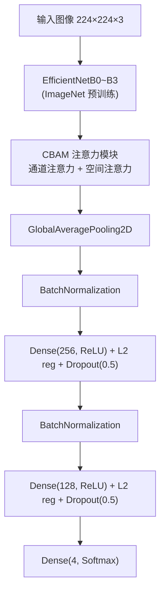
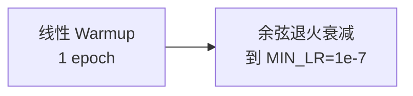

# Chest Cancer Classification — EfficientNet (B0~B3)

基于 TensorFlow / Keras 的肺癌组织病理图像分类项目，使用 EfficientNet 迁移学习进行四分类：**腺癌 (Adenocarcinoma)**、**大细胞癌 (Large Cell Carcinoma)**、**鳞状细胞癌 (Squamous Cell Carcinoma)** 和 **正常组织 (Normal)**。

支持 **EfficientNetB0 ~ B3** 多种骨干网络，附带 **CBAM 注意力机制**、**K-Fold 交叉验证**、**Grad-CAM 可视化诊断** 和 **多图表日志可视化**。

---

## 目录结构

```
Chest_cancer/
├── Data/                     # 数据集（已添加到 .gitignore）
│   ├── train/                # 训练集（按病例文件夹组织）
│   ├── valid/                # 验证集
│   └── test/                 # 测试集（按类别文件夹组织）
├── visualization/            # 可视化脚本与输出
│   ├── visualize.py          #   训练日志可视化（生成 5 张独立图表）
│   ├── training_curves.png   #   两阶段训练曲线
│   ├── confusion_matrix.png  #   混淆矩阵
│   ├── classification_report.png  # 分类指标柱状图
│   ├── metrics_radar.png     #   雷达图
│   ├── dataset_distribution.png   # 数据分布 + 配置
│   ├── gradcam_correct.png   #   Grad-CAM 正确分类样本
│   └── gradcam_wrong.png     #   Grad-CAM 错误分类样本
├── config.py                 # 配置文件
├── data_loader.py            # 数据加载与增强
├── model.py                  # 模型定义（支持 B0~B3）
├── train.py                  # 训练脚本（两阶段迁移学习）
├── evaluate.py               # 评估脚本
├── log_training.py           # 训练日志工具
├── gradcam.py                # Grad-CAM 可视化分析
├── cross_validate.py         # K-Fold 交叉验证入口
├── main.py                   # 主入口
├── README.md                 # 本文件
└── training_logs/            # 训练日志输出目录
    ├── latest.json
    └── train_*.json
```

## 环境配置

### 系统要求
- Python 3.10+
- TensorFlow 2.16+ (Keras 3)
- 推荐 GPU (项目已在 CPU 上测试通过)

### 虚拟环境

```bash
# 创建虚拟环境
python -m venv .venv

# 激活环境
# Windows:
.venv\Scripts\activate
# macOS/Linux:
source .venv/bin/activate

# 安装依赖
pip install tensorflow matplotlib seaborn scikit-learn pandas numpy
```

### VS Code 配置

1. 选择 Python 解释器为 `.venv\Scripts\python.exe`
2. Pylance 可能对 `tf.keras` 的动态导入报错，本项目已改为直接导入 `keras`：
   ```python
   from keras.applications import efficientnet
   from keras.src.legacy.preprocessing.image import ImageDataGenerator
   ```

## 数据集

### 目录结构要求

```
Data/
├── train/                    # 训练集文件夹名可含临床信息
│   ├── adenocarcinoma_left.lower.lobe_T2_N0_M0_Ib/
│   ├── large.cell.carcinoma_left.hilum_T2_N2_M0_IIIa/
│   ├── normal/
│   └── squamous.cell.carcinoma_left.hilum_T1_N2_M0_IIIa/
├── valid/                    # 验证集，结构同 train
└── test/                     # 测试集，使用简洁文件夹名
    ├── adenocarcinoma/
    ├── large.cell.carcinoma/
    ├── normal/
    └── squamous.cell.carcinoma/
```

> ⚠️ **注意**：train/valid 和 test 的文件夹名可以不同，但必须在 `config.py` 中分别配置 `TRAIN_FOLDER_NAMES` 和 `TEST_FOLDER_NAMES`，并保持语义顺序一致。

### 数据分布

| 类别 | 训练集 | 验证集 | 测试集 | 合计 |
|------|:----:|:----:|:----:|:---:|
| adenocarcinoma | 195 | 23 | 120 | 338 |
| large.cell.carcinoma | 115 | 21 | 51 | 187 |
| squamous.cell.carcinoma | 155 | 15 | 90 | 260 |
| normal | 148 | 13 | 54 | 215 |
| **总计** | **613** | **72** | **315** | **1000** |

## 配置文件 (`config.py`)

所有可调参数集中在 `config.py` 中：

| 参数 | 默认值 | 说明 |
|------|--------|------|
| `IMG_SIZE` | 224 | 输入图像尺寸 |
| `BATCH_SIZE` | 32 | 批次大小 |
| `CLASS_NAMES` | [...] | 类别显示名称（用于报告） |
| `TRAIN_FOLDER_NAMES` | [...] | 训练/验证集文件夹名 |
| `TEST_FOLDER_NAMES` | [...] | 测试集文件夹名 |
| `EPOCHS_INITIAL` | 50 | 第一阶段训练轮数 |
| `EPOCHS_FINETUNE` | 30 | 第二阶段训练轮数 |
| `INITIAL_LR` | 1e-3 | 第一阶段学习率 |
| `FINETUNE_LR` | 1e-5 | 第二阶段学习率 |
| `LABEL_SMOOTHING` | 0.1 | 标签平滑系数 |
| `DROPOUT_RATE` | 0.5 | Dropout 比率 |
| `L2_REG` | 1e-4 | L2 正则化系数 |
| `CLASS_WEIGHTS` | {...} | 类别权重（缓解不平衡） |
| **`BACKBONE`** | `'b0'` | **骨干网络：`b0`/`b1`/`b2`/`b3`** |
| **`FREEZE_LAYER_FRACTION`** | 0.6 | **微调冻结底层比例** |
| `USE_ATTENTION` | True | 是否启用 CBAM 注意力 |
| `CBAM_RATIO` | 8 | 通道注意力压缩比 |
| `N_FOLDS` | 5 | 交叉验证折数 |

## 模型架构



### 骨干网络切换

```python
# config.py 中修改
BACKBONE = 'b0'   # 可选: 'b0', 'b1', 'b2', 'b3'
```

| Backbone | 层数 | 参数量 | 相对 B0 | 适用场景 |
|:--------:|:----:|:------:|:-------:|:---------|
| B0 | 238 | 5.2M | 1× | 快速实验、CPU 训练 |
| B1 | 340 | 7.8M | +49% | GPU 可用时推荐 |
| B2 | 340 (更宽) | 9.2M | +76% | 精度优先 |
| B3 | 380 | 12.0M | +130% | 追求最高精度 |

```bash
# 查看模型结构
python model.py b2
```

### CBAM 注意力机制

在骨干网络后、GlobalAveragePooling 之前插入 **CBAM (Convolutional Block Attention Module)**：

- **通道注意力**：学习"哪些特征通道更重要"（AvgPool + MaxPool 双视角）
- **空间注意力**：学习"图像的哪些区域更关键"（7×7 卷积）
- 通过 `config.py` 中 `USE_ATTENTION = True/False` 控制开关

## 训练流程

### 两阶段迁移学习

1. **第一阶段 — 冻结骨干**：冻结 EfficientNet 预训练权重，只训练自定义分类头（50 epochs，早停 patience=8）
2. **第二阶段 — 微调**：按 `FREEZE_LAYER_FRACTION` 比例冻结底层，解冻顶层以小学习率微调（30 epochs，早停 patience=8）

### 学习率调度

采用 **Warmup + Cosine Decay** 策略：



### 数据增强

```python
ImageDataGenerator(
    rotation_range=30,       # 旋转 30°
    width_shift_range=0.15,  # 水平平移 15%
    height_shift_range=0.15, # 垂直平移 15%
    shear_range=0.15,        # 剪切变换
    zoom_range=0.3,          # 缩放 0.7×~1.3×
    horizontal_flip=True,    # 水平翻转
    brightness_range=[0.8, 1.2],  # 亮度调整
    fill_mode='nearest'
)
```

## 运行

```bash
# 完整训练 + 评估
python main.py

# 仅训练
python train.py

# 仅评估（需要已有模型）
python evaluate.py

# K-Fold 交叉验证 + 全量训练 + 最终评估
python cross_validate.py

# 查看预训练模型结构
python model.py b2
```

## 可视化

### 📊 训练日志可视化

生成 5 张独立清晰图表，自动输出到 `visualization/` 目录：

```bash
python visualization/visualize.py
```

| 文件 | 内容 |
|:----|:-----|
| `training_curves.png` | 两阶段训练曲线（双 Y 轴：准确率 + 损失） |
| `confusion_matrix.png` | 混淆矩阵（数量 + 百分比标注） |
| `classification_report.png` | 各类别 Precision / Recall / F1 柱状图 |
| `metrics_radar.png` | 四类指标雷达图 |
| `dataset_distribution.png` | 数据集分布 + 超参配置 |

### 🔍 Grad-CAM 热点图分析

诊断模型关注的图像区域，找出分类混淆的原因：

```bash
# 批量分析测试集
python gradcam.py

# 仅分析前 20 张样本
python gradcam.py --sample 20

# 分析单张图片
python gradcam.py --image path/to/image.jpg

# 仅生成诊断报告
python gradcam.py --grid False
```

输出：
- `visualization/gradcam_wrong.png` — 误判样本的 Grad-CAM 对比网格
- `visualization/gradcam_correct.png` — 正确样本的 Grad-CAM 对比网格
- 终端打印诊断报告：混淆统计、各类别平均概率分析

每张样本展示：**原图 | Grad-CAM 热力图叠加 | 类别概率条**（红色标题 = 误判，绿色 = 正确）。

## K-Fold 分层交叉验证

将 train + valid 的 685 张图像合并，按类别比例分层划分为 K 折（默认 5 折），每折独立训练并报告：

- 每折验证准确率
- 平均准确率 ± 标准差
- 95% 置信区间

运行：`python cross_validate.py`，该脚本依次执行：
1. K-Fold 交叉验证
2. 全量数据完整训练
3. 测试集最终评估
4. 日志归档（含 CV 结果）

## 评估

评估输出包括：
- **测试集准确率**（Loss + Accuracy）
- **分类报告**（Precision / Recall / F1-score 按类别）
- **混淆矩阵热力图**（保存为 `confusion_matrix.png`）
- **训练曲线**（Accuracy / Loss 随 epoch 变化）

## 日志

每次训练会自动记录到 `training_logs/` 目录：

```bash
training_logs/
├── latest.json               # 最近一次训练日志
├── train_20260529_143022.json
└── ...
```

每条日志包含：
- 时间戳
- 完整配置参数
- 每 epoch 的训练/验证指标
- 最终评估结果（准确率、分类报告、混淆矩阵）

## 训练历史

| 训练时间 | 骨干 | Phase1 最佳 Val Acc | Phase2 最佳 Val Acc | 测试集准确率 | 测试集 Loss | 备注 |
|:--------:|:----:|:-------------------:|:-------------------:|:-----------:|:----------:|:----:|
| 2026-05-29 18:58 | B0 | 76.39% (42 epochs) | **83.33%** (10 epochs) | 71.11% | 0.7216 | 首次训练，验证/测试 gap 大 |
| 2026-05-29 23:11 | B0 | 68.06% (29 epochs) | 69.44% (9 epochs) | 73.33% | 0.7205 | 测试 acc 提升 ~2% |
| 2026-05-31 14:27 | B0 | 73.61% (37 epochs) | 75.00% (9 epochs) | **75.24%** | **0.6839** | 🏆 **当前最佳** |
| 2026-06-03 12:32 | B0 | 79.17% (36 epochs) | 79.17% (3 epochs) | 67.94% | 0.8003 | ⚠️ 测试集 acc 下降 |

### 趋势分析

| 指标 | 趋势 |
|:----|:----:|
| 测试准确率 | 71.11% → 73.33% → **75.24%** → 67.94% |
| 测试 Loss | 0.7216 → 0.7205 → **0.6839** → 0.8003 |
| normal 类 F1 | 保持 **0.99** 稳定 ✅ |
| 腺癌 Recall | 55.8% → 80.0% → **70.8%** → 55.8%（波动） |
| 大细胞癌 Recall | 96.1% → 62.7% → 88.2% → **96.1%**（高召回低精度） |

### 当前瓶颈

- **腺癌 (Adenocarcinoma) ↔ 大细胞癌 (Large Cell Carcinoma) 混淆**：40/120 腺癌被误判为大细胞癌（9% 的大细胞癌样本却占了 40 个假阳性）
- **大细胞癌精确率偏低**：43.0% 的精确率说明大量其他类被误判为大细胞癌
- **鳞状细胞癌召回率仅 50%**：20/90 误判为腺癌，25/90 误判为大细胞癌
- **各次训练结果波动较大**：随机种子的确定性有限，数据增强的随机性导致结果不稳定

### 改进方向

- 切换到 **EfficientNetB2/B3** 骨干网络（`config.py` 中改 `BACKBONE = 'b2'`）
- 使用 **Grad-CAM** 诊断混淆原因（`python gradcam.py`）
- 收集更多大细胞癌和鳞癌样本
- 尝试 Focal Loss 替代交叉熵
- 尝试集成学习（多模型投票）

## 已知问题

1. **无 GPU 支持**：当前在 CPU 上运行，训练较慢。若使用 GPU，TensorFlow 需通过 WSL2 或 TensorFlow-DirectML 插件。
2. ~~**类别混淆**：Adenocarcinoma 和 Large Cell Carcinoma 之间仍存在一定混淆。~~ → **已引入 CBAM 注意力机制缓解 + Grad-CAM 诊断**
3. ~~**未做交叉验证**：仅依赖单次 train/valid 划分评估性能。~~ → **已实现 K-Fold 分层交叉验证**
4. **测试集波动**：最近一次训练 Phase1 val_acc 最高 (79.17%) 但测试集 acc 反而下降 (67.94%)，提示需要更稳定的训练策略。

## 许可

仅供学习研究使用。
